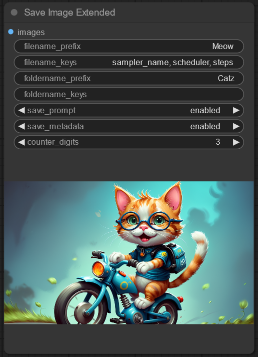
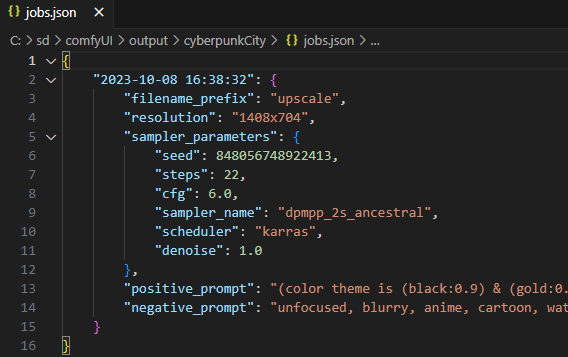

# Save Image Extended for ComfyUI

 

 Customize the information saved in file- and folder names. Use the values of sampler parameters as part of file or folder names. <br>Save your positive & negative prompt as entries in a JSON (text) file, in each folder.

 ## Installation
1. Open a terminal inside the 'custom_nodes' folder located in your ComfyUI installation dir
2. Use the `git clone` command to clone the [save-image-extended-comfyui](https://github.com/thedyze/save-image-extended-comfyui) repo.
```
git clone https://github.com/thedyze/save-image-extended-comfyui
```

## Input Parameters / Usage

- `filename_prefix` -  String prefix added to files
- `filename_keys` - Comma separated string with sampler parameters to add to filename. E.g: `sampler_name, scheduler, cfg, denoise` Added to filename in written order.
- `foldername_prefix` - String prefix added to folders
- `foldername_keys` - Comma separated string with sampler parameters to add to foldername
- `save_prompt` - Saves the positive & negative prompt text as an entry with timestamp in a `prompt.json` text file, inside the generated folder.
- `save_metadata` - Saves metadata into the image
- `counter_digits` - The number of digits used for the image counter. `3` = image_001.png. Will adjust the counter if you delete files. Looks for the highest number in the folder, but does not fill gaps.

Does not check for illegal characters in entered file or folder names. May not be compatible with every other custom node, depending on changes in the `prompt` object. Tested and working with default samplers, Efficiency nodes and UltimateSDUpscale.
#
<br>

 

 Happy saving!


